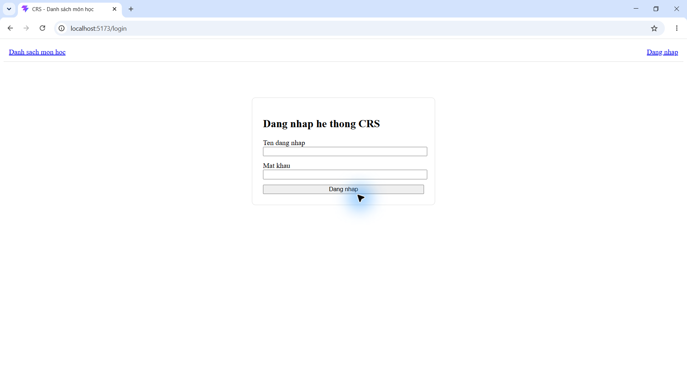
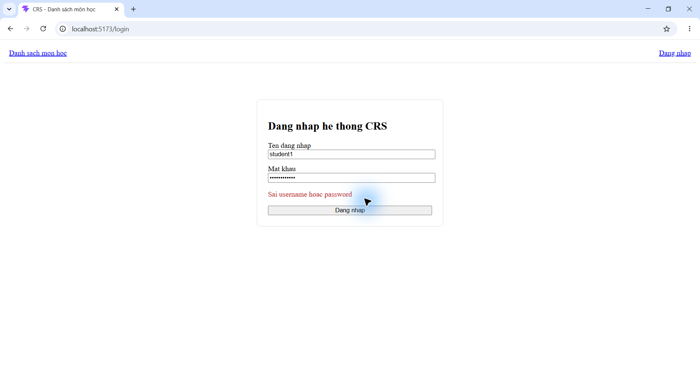
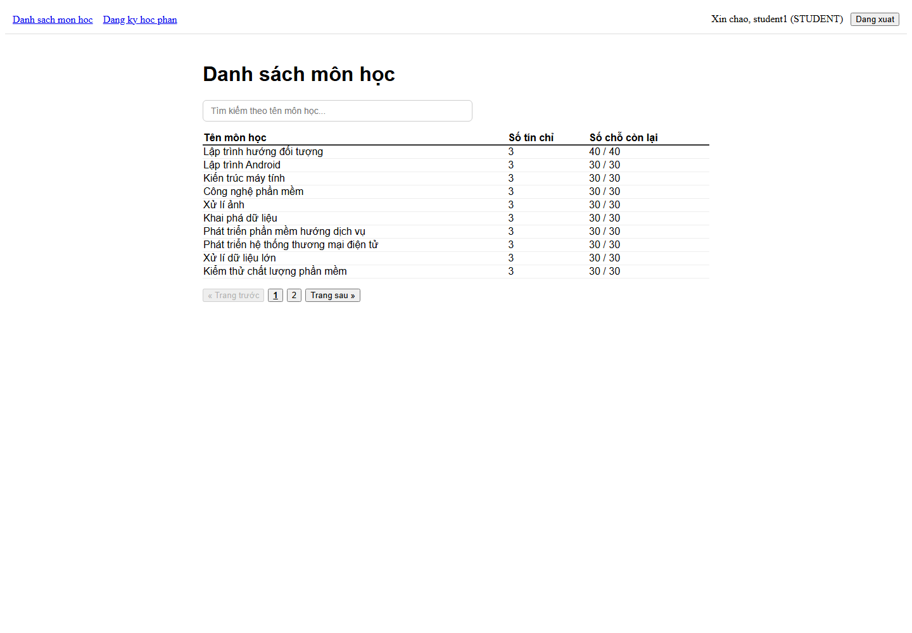
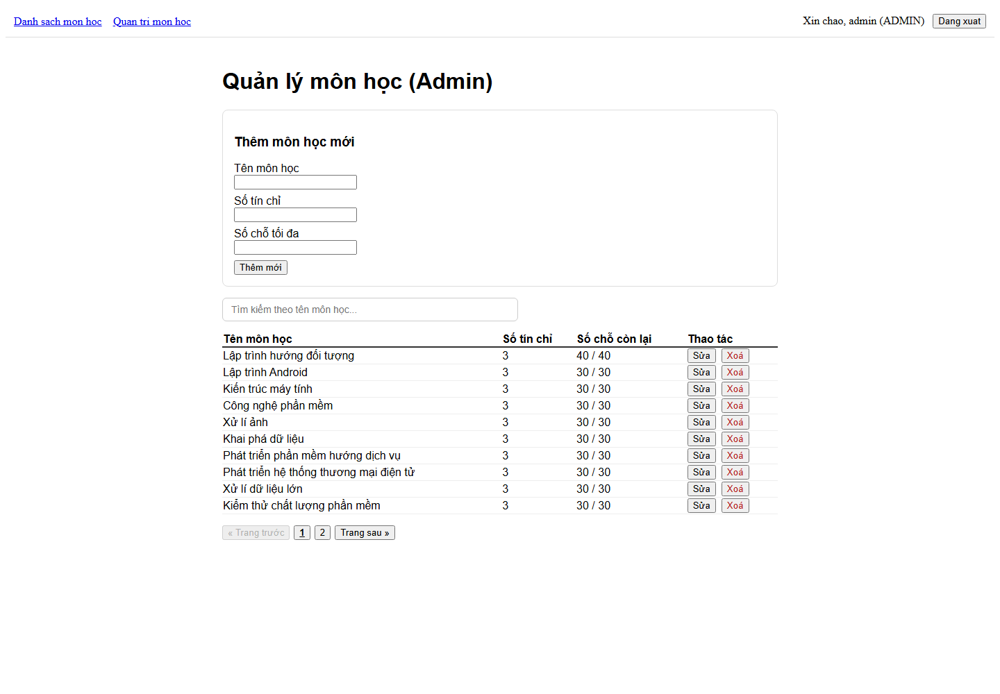
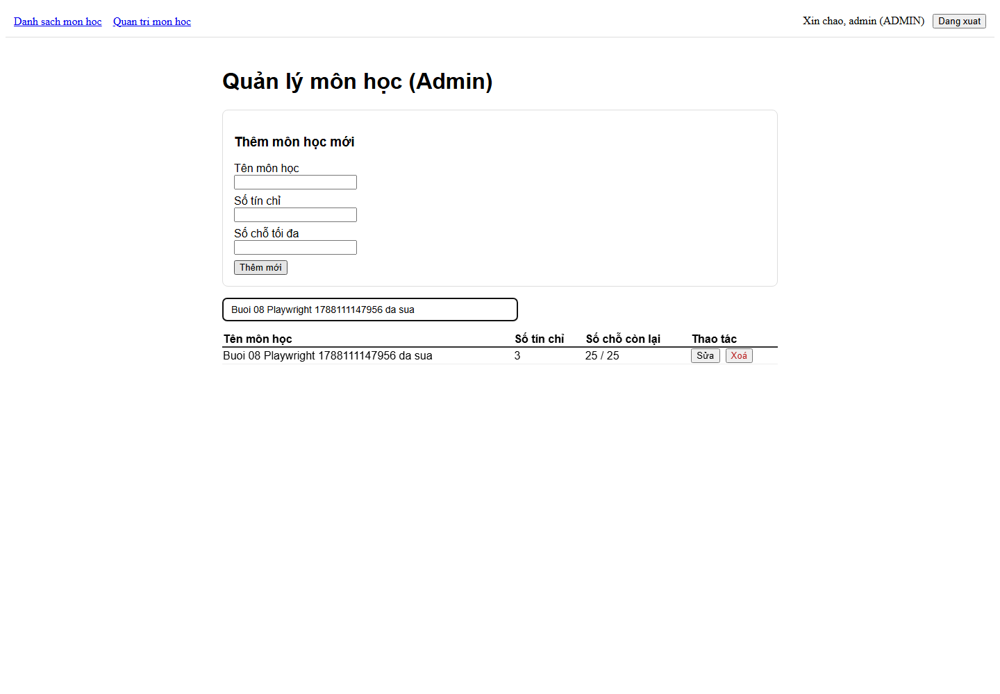
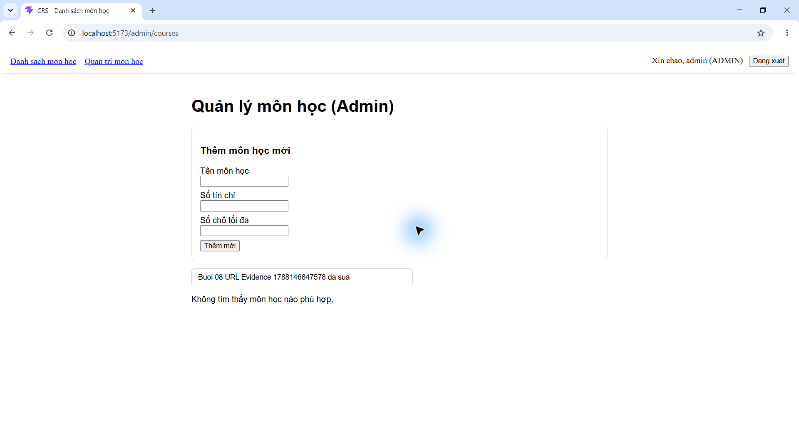
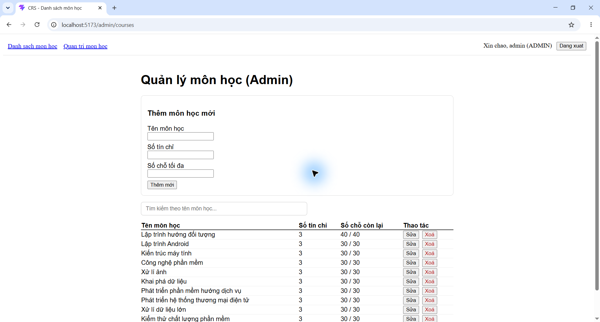
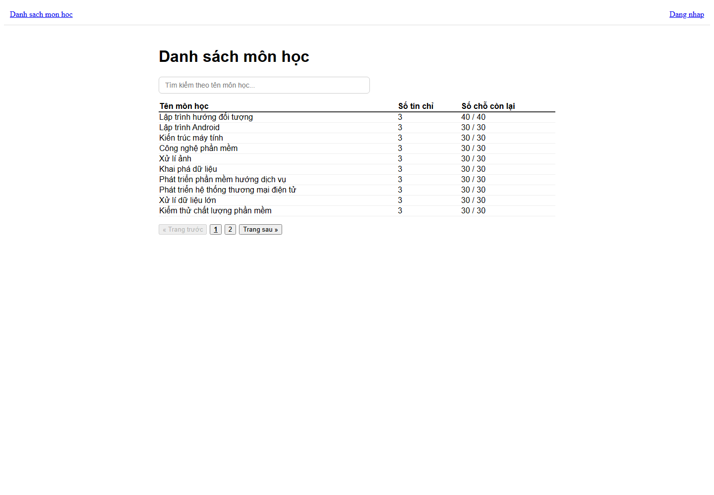
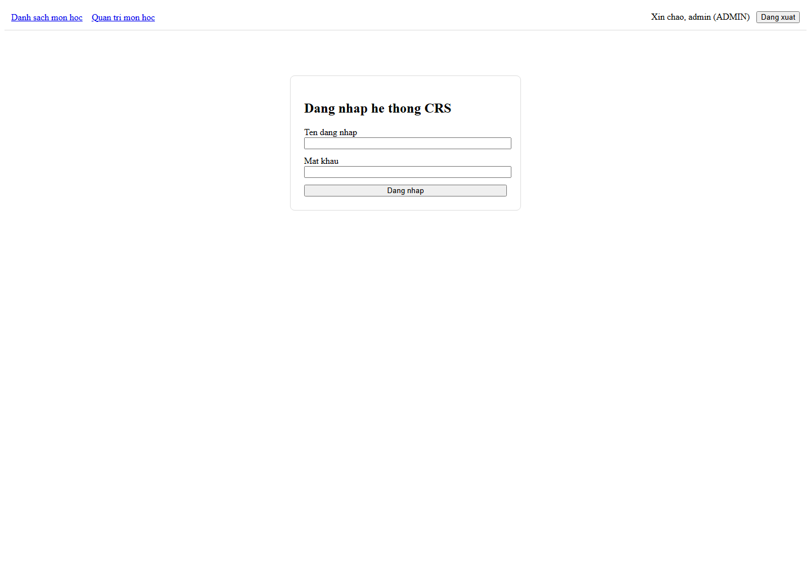
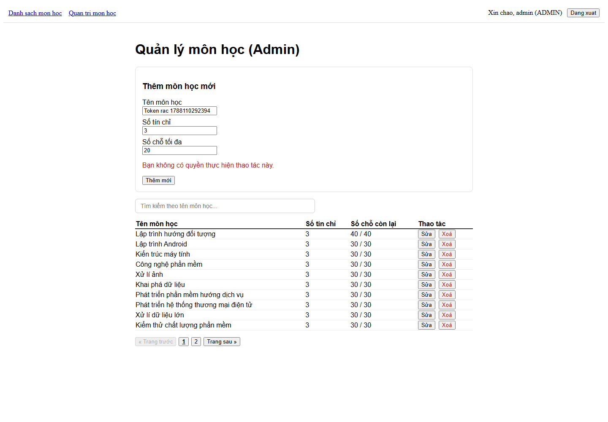

# BÁO CÁO BUỔI 08

## 1. Tóm tắt file đã tạo/sửa

| Đường dẫn | Mục đích |
|---|---|
| `crs-frontend/src/App.tsx` | Thay nội dung CRUD cũ bằng cấu hình `BrowserRouter` và 4 route của Buổi 8. |
| `crs-frontend/src/pages/CoursesPage.tsx` | Di chuyển nguyên thân `App.tsx` Buổi 6 sang trang danh sách công khai, không có CRUD. |
| `crs-frontend/src/pages/AdminCoursesPage.tsx` | Di chuyển nguyên thân `App.tsx` Buổi 7 sang trang CRUD dành cho ADMIN. |
| `crs-frontend/src/pages/LoginPage.tsx` | Form đăng nhập, gọi Auth API, lưu AuthContext và điều hướng. |
| `crs-frontend/src/pages/RegisterCoursePage.tsx` | Khung trang đăng ký học phần được bảo vệ cho STUDENT. |
| `crs-frontend/src/api/authApi.ts` | Gọi `POST /api/auth/login` qua Gateway bằng `axiosClient`. |
| `crs-frontend/src/api/axiosClient.ts` | Giữ nguyên Request Interceptor; chỉ nối thêm Response Interceptor xử lý 401. |
| `crs-frontend/src/context/AuthContext.tsx` | Quản lý user, `crs_token`, `crs_user`, login/logout, khôi phục phiên và chờ hydrate trước khi render route. |
| `crs-frontend/src/components/ProtectedRoute.tsx` | Chặn route khi chưa đăng nhập hoặc sai role. |
| `crs-frontend/src/components/Navbar.tsx` | Hiển thị menu, lời chào và nút đăng xuất theo role. |
| `crs-frontend/src/components/CourseList.tsx` | Chuyển `onEdit`/`onDelete` thành optional và chỉ hiện cột thao tác khi có handler. |
| `crs-frontend/playwright.config.ts` | Cấu hình Playwright chạy tuần tự, không retry, base URL `localhost:5173`. |
| `crs-frontend/tests/buoi08.spec.ts` | Tự động hoá đủ 8 kịch bản, assertion HTTP/UI/localStorage, chụp ảnh và dọn dữ liệu CRUD tạm. |
| `crs-frontend/eslint.config.js` | Cấu hình ESLint cho React + TypeScript. |
| `crs-frontend/package.json`, `crs-frontend/package-lock.json` | Bổ sung Playwright, ESLint và script `lint`. |
| `crs-frontend/.gitignore` | Bỏ qua output tạm `test-results` và `playwright-report`. |
| `course-service/src/main/java/vn/edu/crs/courseservice/config/SecurityConfig.java` | Trả 401 cho request không xác thực/token hỏng; vẫn giữ 403 cho user đã xác thực nhưng sai role. |
| `course-service/src/test/java/vn/edu/crs/courseservice/controller/CourseControllerIntegrationTest.java` | Bổ sung test hồi quy token rác phải nhận 401; test STUDENT nhận 403 vẫn được giữ. |
| `crs-frontend/bao-cao/screenshots/*.png` | Ảnh trạng thái thật của từng kịch bản và các lỗi đã gặp trước khi sửa. |
| `crs-frontend/bao-cao/BAO_CAO_BUOI_08.md` | Báo cáo đối chiếu, kết quả test và trạng thái Git. |

## 2. Đối chiếu sản phẩm đầu ra cuối buổi

- ☑ `react-router-dom` hoạt động với 4 route: `/login`, `/courses`, `/admin/courses`, `/register-course`.
- ☑ Đăng nhập thật qua `POST /api/auth/login`; không còn dán token bằng tay.
- ☑ AuthContext giữ đúng trạng thái và khôi phục phiên sau F5.
- ☑ Request Interceptor Buổi 7 được giữ nguyên; Response Interceptor Buổi 8 xử lý 401 và tự đăng xuất.
- ☑ ProtectedRoute chặn đúng người chưa đăng nhập và người sai role.
- ☑ CourseList ẩn cột `Thao tác` tại `/courses`.
- ☑ Frontend chỉ gọi API qua Gateway `http://localhost:8080`.
- ☑ Git có commit `feat: routing + login via auth-service + interceptor + protected route` và đã push.

## 3. Kết quả 8 kịch bản

### Kịch bản 1 — Chưa đăng nhập truy cập `/admin/courses`

- Thao tác: xoá `crs_token` và `crs_user`, mở trực tiếp `/admin/courses`.
- Kết quả thực tế: **ĐẠT** — URL chuyển sang `/login`, trang hiển thị form đăng nhập.

### Kịch bản 2 — Sai mật khẩu

- Thao tác: đăng nhập `student1` với mật khẩu sai.
- Kết quả thực tế: **ĐẠT** — `POST /api/auth/login` trả 401 và giao diện hiện đúng `Sai username hoac password`.

### Kịch bản 3 — Student đăng nhập đúng

- Thao tác: đăng nhập `student1/student123`.
- Kết quả thực tế: **ĐẠT** — chuyển tới `/courses`, Navbar hiện `Xin chao, student1 (STUDENT)` và `Dang ky hoc phan`. Automation cũng mở link này và xác nhận route `/register-course` hiển thị khung trang đúng.

### Kịch bản 4 — Student gõ tay URL admin

- Thao tác: sau khi đăng nhập Student, dùng full document navigation tới `/admin/courses` (tương đương gõ tay URL).
- Kết quả thực tế: **ĐẠT** — chuyển về `/courses`, vẫn giữ phiên Student và không chuyển nhầm về `/login`.

### Kịch bản 5 — Admin xem/sửa/xoá

- Thao tác: đăng xuất Student, xác nhận hai key localStorage đã bị xoá, đăng nhập `admin/admin123`, mở `/admin/courses`.
- Kết quả thực tế: **ĐẠT** — Navbar hiện menu `Quan tri mon hoc`; form và cột `Thao tác` hiện đúng. Playwright tạo một môn test có tên duy nhất, sửa tên, sau đó xoá đúng bản ghi. API lần lượt trả 201/200/204 và không còn dữ liệu test trong database.

### Kịch bản 6 — F5 khi đang đăng nhập

- Thao tác: đang ở `/admin/courses` với phiên ADMIN, reload toàn bộ trang.
- Kết quả thực tế: **ĐẠT** — URL vẫn là `/admin/courses`, Navbar vẫn hiện ADMIN và trang CRUD vẫn hiển thị.

### Kịch bản 7 — Token rác tự đăng xuất

- Thao tác: tại trang admin, thay `crs_token` bằng chuỗi rác, điền đủ form hợp lệ và bấm `Thêm mới` để request thật được gửi.
- Kết quả thực tế: **ĐẠT** — `POST /api/courses` trả 401; Response Interceptor xoá cả `crs_token`/`crs_user` và chuyển sang `/login`.

### Kịch bản 8 — Trang công khai không có thao tác

- Thao tác: xoá phiên, mở `/courses`, chờ bảng dữ liệu hiển thị.
- Kết quả thực tế: **ĐẠT** — không có header `Thao tác`, nút `Sửa` hoặc `Xoá`.

## 4. Lỗi đã gặp và cách xử lý

### 4.1. Maven/Vite không xử lý được đường dẫn workspace có dấu

- Trạng thái thật: Maven `spring-boot:run` tạo classpath bị sai ký tự và báo `ClassNotFoundException`; Vite dev báo không load được `/src/main.tsx`, trang trắng.
- Cách xử lý: ánh xạ repo tạm qua ổ `X:` có đường dẫn ASCII để chạy Maven; frontend được build rồi phục vụ bằng `vite preview` trên đúng `localhost:5173`.

### 4.2. ProtectedRoute redirect trước khi AuthContext khôi phục phiên

- Trạng thái thật: lần chạy đầu, case 4 chuyển Student về `/login` thay vì `/courses`; case 6 F5 admin cũng chuyển nhầm về `/login`.
- Nguyên nhân: `ProtectedRoute` render trong khi `useEffect` khôi phục localStorage chưa chạy xong.
- Cách xử lý: thêm cờ `isAuthReady` và chỉ render children sau khi đã đọc localStorage; chạy lại hai case và sau đó toàn bộ suite đều đạt.

### 4.3. Token rác ban đầu nhận 403 thay vì 401

- Trạng thái thật: request POST với token rác ban đầu nhận 403; frontend hiển thị lỗi quyền và không đăng xuất. Test vẫn giữ assertion 401, không nới sang 403.
- Nguyên nhân: `JwtAuthFilter` xoá context khi parse token thất bại, sau đó Spring Security dùng response 403 mặc định cho request anonymous.
- Cách xử lý: sau khi được cho phép mở rộng phạm vi, bổ sung `AuthenticationEntryPoint` trả 401 và test hồi quy. STUDENT đã xác thực nhưng sai role vẫn nhận 403.

### 4.4. Rule lint mới không phù hợp mẫu code bài lab

- Trạng thái thật: `react-hooks/set-state-in-effect` báo lỗi cho ba effect có chủ đích: tải API, nạp form sửa và khôi phục localStorage.
- Cách xử lý: tắt riêng rule React Compiler này trong ESLint; giữ nguyên luồng `useEffect` mà tài liệu Buổi 6–8 yêu cầu. Các rule còn lại chạy và không có lỗi.

## 5. Kết quả build/lint/test cuối cùng

- `npm run lint`: **PASS**, ESLint hoàn tất với 0 error, 0 warning.
- `npm run build`: **PASS**, TypeScript build và Vite production build thành công; 103 module được transform.
- `npx playwright test`: **PASS**, 8/8 kịch bản đạt, 0 failed, `workers=1`, `retries=0`.
- `course-service` Maven test: **PASS**, 10 test, 0 failure, 0 error, 0 skipped.
- Kiểm tra dữ liệu sau Playwright: không còn course tạm có prefix `Buoi 08 Playwright` hoặc `Token rac`.

## 6. Trạng thái Git commit/push

- Feature commit: `85207df2f1bbc82c4884eba39330494d84def709` — `feat: routing + login via auth-service + interceptor + protected route`.
- Push: **THÀNH CÔNG** — `origin/main` đã cập nhật từ `df91a7d` lên `85207df`.
- File báo cáo được commit/push ở commit tài liệu tiếp theo để có thể ghi hash feature thật, không dùng placeholder.
